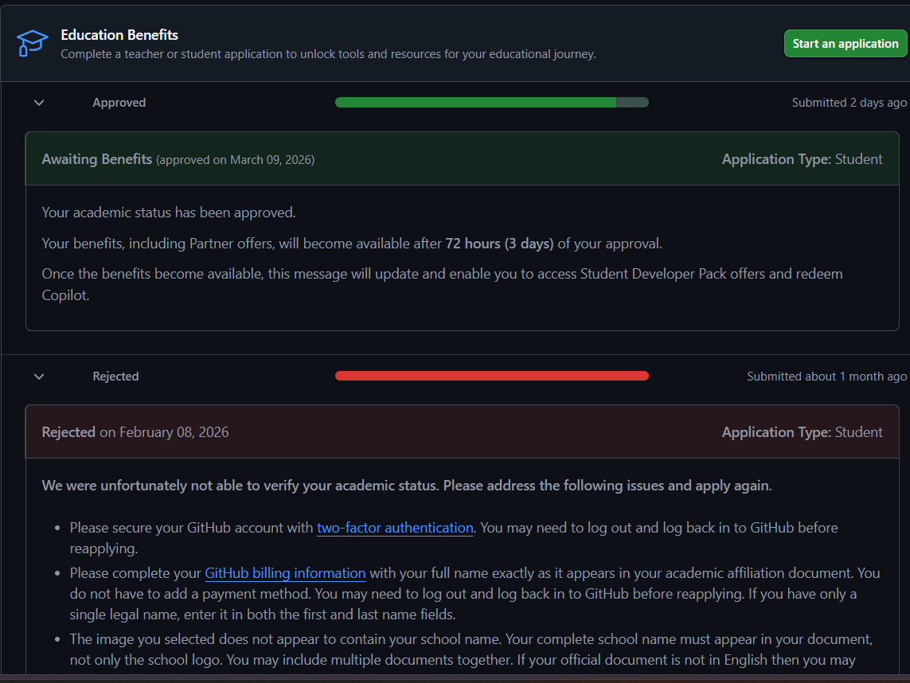

# Reflection on W07 - Introduction to Positron {.unnumbered}

This reflection summarizes my experience installing and learning Positron through the assigned videos and workshop materials. I followed the demonstrations while becoming familiar with the interface and tools within Positron. The sessions showed how Positron combines features from RStudio with modern tools similar to VS Code, while also introducing built-in AI tools designed specifically for data science workflows.

This report also demonstrates several Quarto HTML features including a table of contents, section numbering, lists, callout blocks, cross-references, a tabset, footnotes, and hidden code.

# Download and Install Positron

::: {.callout-important appearance="minimal"}
**Prompt:** Download and Install Positron. As you watch the videos in Step 1 and Step 3, follow the activities in the video and become familiar with Positron.
:::

:::::: columns
::: {.column width="62%"}
The first step in the workshop was downloading and installing Positron. After installing it, I created a project folder and opened it as my working directory, which is how Positron encourages users to organize projects.

When Positron first opens, it feels structured and workspace-oriented. That made it easier to understand where files, code, output, and tools belong. The layout felt familiar enough to someone coming from RStudio, while still looking and behaving more like a modern editor.

The transcripts also emphasized that Positron is **multilingual**, which is one of the biggest differences from a more traditional RStudio-centered experience. Positron supports **R and Python**, and the demos showed that it can even switch contexts automatically depending on the file being used. I thought that was especially interesting because it reflects the reality that many data science workflows are no longer limited to one language.
:::

:::: {.column width="38%"}
::: {.callout-note appearance="simple"}
### What I Practiced

-   downloading and installing Positron
-   creating and opening a project folder
-   exploring the interface layout
-   opening Quarto documents
-   identifying where files, code, output, and tools appear
-   noticing support for both **R** and **Python**
:::
::::
::::::

::: panel-tabset
### Main Workspace Areas

-   **File explorer:** used to navigate project folders and files\
-   **Editor pane:** where code files, markdown files, and Quarto documents are opened\
-   **Terminal/console area:** where commands and code can be run\
-   **Right sidebar/panels:** where variables, plots, Git, AI tools, and previews can appear

### Workflow Tools

-   **Toolbar:** used for running code and managing project actions\
-   **Tabbed editor:** allows multiple files to stay open at once\
-   **Command Palette:** helps users quickly search for commands and tools\
-   **Menu bar:** provides access to standard application functions

### My First Impression

What stood out to me most was that Positron feels organized around projects instead of isolated files. That makes it easier to manage code, reports, and data together in one place, which seems especially useful for coursework and reproducible analysis.
:::

# What I Like About Positron Compared with RStudio

::: {.callout-important appearance="minimal"}
**Prompt:** Based on what you learned from Step 1 and Step 3, what do you like about Positron compared with RStudio?
:::

Based on the videos, there are several things I like about Positron compared with RStudio. Some of the key advantages include: - The interface is more modern and visually appealing, with a layout that feels more intuitive for coding and project management. - At the same time, Positron still keeps important data science features front and center. The videos showed how users can interact with variables in memory, inspect plots, preview HTML output, and use the **Data Viewer** or **Data Explorer** to sort, filter, and inspect datasets without having to leave the IDE. That feels very practical. - Another feature I liked was the **Command Palette**. The transcript showed how it can be used to quickly open files, run commands, and access tools like Databot. That seems faster and more efficient than searching through menus. -I also liked that Positron supports **extensions**, including ones that come from the same open framework used by VS Code. The workshop specifically mentioned tools like **Databot** and **Air**, and I can see how that makes Positron easier to customize for different workflows. - Finally, the built-in AI tools are a big plus. The videos showed how they can assist with code generation, data analysis, and even writing documentation. That seems like a powerful way to boost productivity and creativity. Overall, I think Positron offers a more modern and flexible environment for data science compared to RStudio, while still retaining the core features that data scientists rely on.

See Table @tbl-comparison for a summary.

| Feature | Positron | RStudio |
|------------------------|------------------------|------------------------|
| Interface | More modern and flexible | More traditional |
| Language support | Strong R and Python support | Strong R focus |
| AI tools | Built-in and extension-based AI features | More limited |
| Extensions | Broad extension ecosystem | More limited |
| Workflow tools | Command Palette, Git integration, extensions | Basic Git support |

: Comparison of Positron and RStudio {#tbl-comparison}

# AI Tools and Features in Positron

::::::::::::::::::::: {.callout-important appearance="minimal"}
**Prompt**

3.  In Step 4, the video demonstrates how you can use AI.

4.  Describe the various ways you can use AI inside Positron. Some are free while others are not.

::::::: columns
:::: {.column width="50%"}
::: {.callout-tip appearance="simple"}
### 💻 Coding Assistance

One of the most common uses of AI inside Positron is helping write or complete code. Tools such as **Positron Assistant** and **GitHub Copilot** can analyze the code currently being written and suggest completions or improvements. This reduces the time spent searching documentation and helps speed up development.
:::
::::

:::: {.column width="50%"}
::: {.callout-note appearance="simple"}
### 🛠 Debugging and Code Explanation

AI can also help troubleshoot problems in code. Because the assistant has access to the open files and project context, it can explain error messages, identify possible mistakes, and suggest ways to fix problems.
:::
::::
:::::::

------------------------------------------------------------------------

::::::: columns
:::: {.column width="50%"}
::: {.callout-important appearance="simple"}
### 📊 Data Exploration

The workshop also demonstrated **Databot**, which focuses on data science workflows. Databot can generate code to summarize datasets, create visualizations, and explore patterns in the data.
:::
::::

:::: {.column width="50%"}
::: {.callout-tip appearance="simple"}
## 📝 Documentation and Communication

AI tools can also generate documentation or explanations of code. For example, an assistant may suggest comments or explain functions, helping maintain clear and readable projects.
:::
::::
:::::::

2.  Which AI tools have you installed or set up? Which AI tools did you find beneficial for you?

During this workshop I explored several AI tools that can be used inside the Positron environment. Each tool focuses on a different part of the development workflow, from writing code to exploring datasets.

::: callout-note
## AI Tools I Explored

Open each section below to see how it works inside Positron.
:::

<details>

<summary><strong>🤖 GitHub Copilot</strong></summary>

GitHub Copilot is an AI coding assistant that suggests code in real time while you type. It analyzes the surrounding code and predicts possible completions for functions, loops, or other programming structures. Because the suggestions appear directly in the editor, it can help speed up development and reduce the time spent searching documentation for syntax examples.

</details>

<details>

<summary><strong>💡 Positron Assistant</strong></summary>

The Positron Assistant is designed specifically for the Positron environment. It can analyze the code currently open in the editor and provide suggestions or explanations related to the project. This makes it useful for debugging, improving code structure, or understanding unfamiliar code.

</details>

<details>

<summary><strong>📊 Databot</strong></summary>

Databot focuses more on data science workflows rather than general programming. It can generate code for exploring datasets, producing summary statistics, and creating visualizations. This makes it especially helpful when working with new datasets and trying to quickly understand the structure of the data.

</details>

The tool I found most beneficial was **GitHub Copilot** because it provides real-time suggestions while coding. It helps reduce repetitive typing and makes it easier to build functions quickly. At the same time, it is important to review the generated code carefully to ensure the suggestions are correct.

3.  I strongly recommend using GitHub Copilot, which is free if you apply for an education account.

    1.  Apply for it and take a screenshot showing you were accepted into the education program.

{fig-align="center" width="80%"}

```         
2. Play with it and do you find it helpful or distracting? Please elaborate.
```

> > My Experience Using GitHub Copilot:

::::::::: columns
:::: {.column width="33%"}
::: {.callout-note appearance="simple"}
**Before Using It**

Before trying GitHub Copilot, I expected it to mostly be a shortcut tool for writing code faster. I thought it would probably help with small syntax issues, but I was not sure how useful it would actually be in real time while working.
:::
::::

:::: {.column width="33%"}
::: {.callout-tip appearance="simple"}
**What It Helped With**

Once I started using it, I noticed that Copilot was especially helpful when I was writing repetitive code or trying to remember the exact syntax for something. For example, when starting a loop or a simple function, it often suggested the rest of the structure before I finished typing. That saved time and made the process feel smoother.

It was also useful when I knew what I wanted to do but could not remember the exact wording of the code right away. Instead of stopping to search online, I could often use the suggestion as a starting point.
:::
::::

:::: {.column width="33%"}
::: {.callout-important appearance="simple"}
**What Still Needed My Judgment**

Even though Copilot was helpful, I still had to pay attention to what it generated. Some suggestions looked correct at first glance, but I still needed to check whether they actually matched what I was trying to do. Because of that, I do not see it as something that replaces thinking. I see it more as a support tool that helps me move faster while still requiring me to understand the code.
:::
::::
:::::::::

> **My overall takeaway:** GitHub Copilot felt more helpful than distracting because it reduced repetitive typing, helped with syntax, and kept my workflow moving. At the same time, it worked best when I treated it like a helpful assistant rather than something to follow automatically.
:::::::::::::::::::::